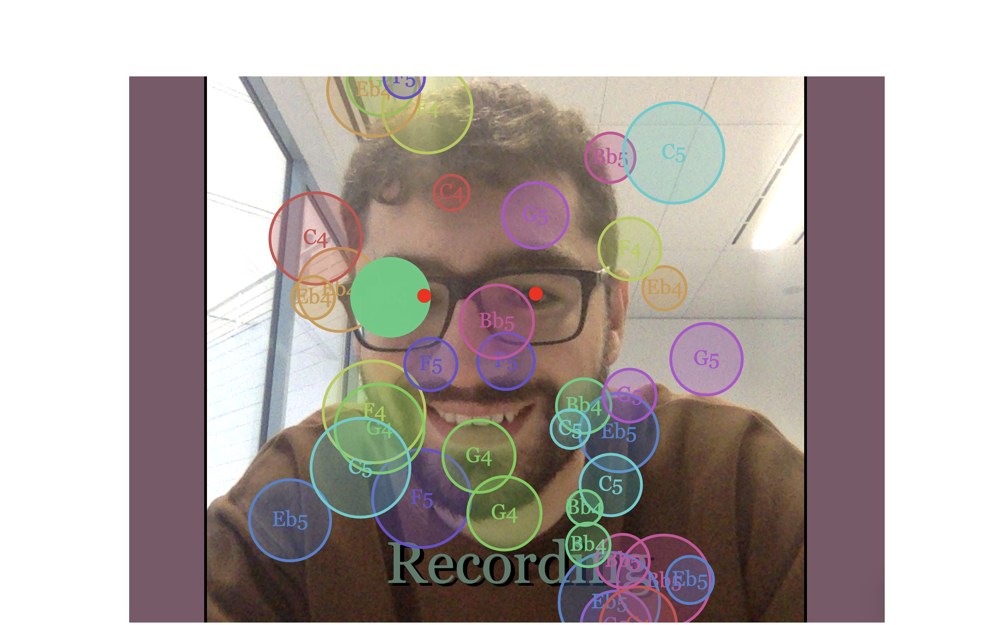

## What Does Your Face Sound Like?
### [Link](https://anthonygdoueihi.github.io/what-does-your-face-sound-like/)

## About The Project

"What Does Your Face Sound Like?" is a project completed as apart of General Assembly's Software Engineering Immersive Course.

Users can use this project to create music using Synthesisers and Drum Samples, with only the movements of their face and head. 

This project was originally intended to make your face into an instrument, taking parts of the face and making them make certain sounds. Unfortunately that level of detail is not what face-api.js was designed to do, and so I chose to gamify the creation of the song. p5.js was the 2D canvas library I decided to use because it had its own function to retrieve the webcam, making it convenient to draw on top of it. 

This created an issue of its own. ToneJS is typically timed in beats while p5.js has a draw function that runs every frame. The solution to this was a simple distinction of the functions p5 use to draw the information and the functions ToneJS use to get the information. From there is was all deciding how to make which parts of the music and storing that data in arrays that ToneJS was playing from.

### Built With
* [face-api.js](https://github.com/justadudewhohacks/face-api.js)
* [tone.js](https://tonejs.github.io/)
* [p5.js](https://p5js.org/)
* [tonal](https://github.com/tonaljs/tonal)

<!-- GETTING STARTED -->
### Running Locally

There is no required external install, but a local server is needed to access the webcam.

AND THANK YOUS TO JOEL AND YIANNI
