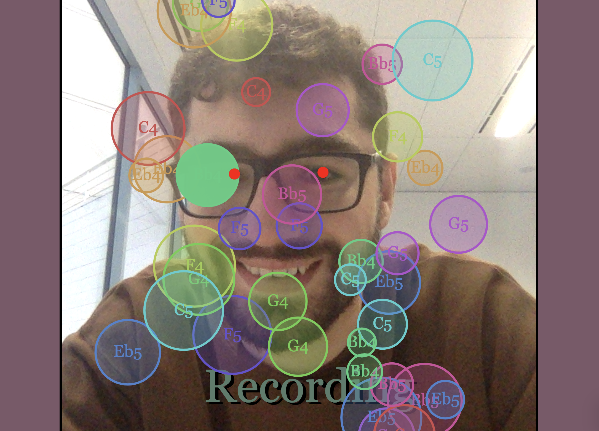

## What Does Your Face Sound Like?
### [Link](https://anthonygdoueihi.github.io/what-does-your-face-sound-like/)

## About The Project

"What Does Your Face Sound Like?" is a project completed as apart of General Assembly's Software Engineering Immersive Course.

"What Does Your Face Sound Like?" was created as an experiment, users can use this to create music using Synthesisers and Drum Samples, using only their face movements. Requires the device to have a webcam.

### Built With
* [face-api.js](https://github.com/justadudewhohacks/face-api.js)
* [tone.js](https://tonejs.github.io/)
* [p5.js](https://p5js.org/)
* [tonal](https://github.com/tonaljs/tonal)

<!-- GETTING STARTED -->
### Local

There is no required external install, but a local server is required to access the webcam.
